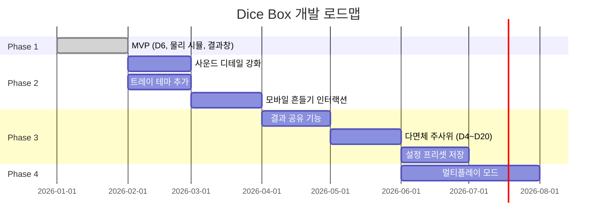

# Dice Box

> 주사위가 필요한 모든 순간, 실제 주사위의 '손맛'과 '편의성'을 동시에 제공하는 물리 기반 웹 서비스

---

## 1. 프로젝트 개요

| 항목 | 내용 |
|------|------|
| **서비스명** | Dice Box |
| **목적** | 보드게임, TRPG 등 주사위가 필요한 상황에서 실제 주사위의 움직임을 재현한 디지털 도구 제공 |
| **핵심 가치** | 사실적인 물리 연산, 게임별 맞춤형 결과 분석, 직관적인 UX |

---

## 2. Scene별 상세 구성

### 2.1 시작 페이지 (Start Scene)

**기본 기능:** 타이틀 및 주사위 옵션 설정

#### 설정 옵션

| 옵션 | 설명 |
|------|------|
| 주사위 개수 | 1개 ~ 10개 (슬라이더 조절) |
| 주사위 색상 | 프리셋 팔레트 제공 |
| 주사위 종류 | 기본 육면체(D6) 우선 제공 후 다면체(D4, D8, D10, D12, D20) 확장 예정 |

#### 추가 기능

- **프리셋 저장**: '라스베가스용', 'TRPG용' 등 자주 쓰는 설정 저장 기능
- **트레이 테마**: 주사위가 굴러가는 바닥 재질(나무, 가죽, 우주 등) 선택

---

### 2.2 주사위 던지기 페이지 (Rolling Scene)

**기본 기능:** 3D 물리 시뮬레이션 애니메이션

#### 애니메이션
- 컵 안에 넣고 흔들기
- 타워에서 떨어지는 효과

#### 효과음 (SFX)
- 주사위 간 충돌음
- 트레이 바닥 충돌음 (두 종류 구분)

#### 추가 기능

- **동적 사운드**: 충돌 속도(Velocity)에 따른 실시간 볼륨/피치 변조
- **인터랙션**: 모바일 가속도계 연동(기기 흔들기) 및 햅틱 피드백(진동) 지원

---

### 2.3 결과 페이지 (Result Scene)

**기본 기능:**
- 모든 눈금의 합계 계산 및 표시
- 눈금별 분류(Grouping): 같은 눈금끼리 묶어 보기 (라스베가스 보드게임 대응)

#### 제어 버튼

| 버튼 | 동작 |
|------|------|
| 다시 던지기 | 현재 설정 그대로 즉시 재실행 |
| 시작 페이지로 | 모든 설정 초기화 및 첫 화면 이동 |

#### 추가 기능

- **히스토리 로그**: 최근 던진 결과 5회분 기록 표시
- **통계 보기**: 각 눈금의 출현 빈도 데이터 시각화

---

## 3. 기술 사양

### 3.1 그래픽 및 물리 엔진

| 항목 | 기술 |
|------|------|
| **Rendering** | Three.js를 이용한 실시간 3D 웹 렌더링 |
| **Physics** | Cannon-es를 통한 실제 물리 법칙 적용 |
| **판정 로직** | 주사위가 'Sleep' 상태일 때 윗면 법선 벡터(n̂) 계산을 통한 눈금 판정 |

### 3.2 사운드 시스템

- **AudioContext API**: 외부 오디오 파일 없이 실시간 합성(Synthesis)을 통한 충돌음 생성 (로딩 속도 최적화)
- **공간감**: 주사위의 월드 좌표에 따른 스테레오 패닝(Panning) 적용 고려

### 3.3 사용자 경험 (UX)

- **Responsive Design**: 모바일 세로 모드에 최적화된 Mobile-First 레이아웃
- **PWA (Progressive Web App)**: 앱 설치 없이 홈 화면에 추가하여 오프라인 실행 지원 예정

---

## 4. 로드맵 (Roadmap)



| Phase | 목표 | 상태 |
|-------|------|------|
| **Phase 1 (MVP)** | D6 주사위, 기본 물리 시뮬레이션, 합계/분류 결과창 구현 | ✅ 완료 |
| **Phase 2 (UX)** | 사운드 디테일 강화, 트레이 테마 추가, 모바일 흔들기 인터랙션 | 🔄 진행 예정 |
| **Phase 3 (Expansion)** | 다면체(D4~D20) 주사위 에셋 추가, 설정 프리셋 저장 기능 | ⏳ 예정 |
| **Phase 4 (Cloud)** | 멀티플레이 모드 (여러 사용자가 같은 결과를 공유) | ⏳ 예정 |

---

## 5. 개발 가이드

### 기술 스택

| 분류 | 기술 |
|------|------|
| **Frontend** | HTML5, CSS3, JavaScript (ES6+) |
| **3D Rendering** | Three.js |
| **Physics Engine** | Cannon-es |
| **Audio** | Web Audio API (AudioContext) |
| **스타일링** | Vanilla CSS |

### 프로젝트 구조

```
DiceBoxWeb/
├── index.html              # 메인 HTML
├── css/
│   └── style.css           # 스타일시트
├── js/
│   ├── main.js             # 앱 진입점
│   ├── scene/
│   │   ├── StartScene.js   # 시작 페이지
│   │   ├── RollingScene.js # 주사위 던지기
│   │   └── ResultScene.js  # 결과 페이지
│   ├── physics/
│   │   └── DicePhysics.js  # 물리 엔진 래퍼
│   └── audio/
│       └── SoundManager.js # 사운드 시스템
├── assets/
│   ├── textures/           # 텍스처 리소스
│   └── models/             # 3D 모델 (필요시)
└── gemini.md               # 프로젝트 문서
```

### 코딩 컨벤션

#### JavaScript
- 변수 선언: `const`, `let` 사용 (`var` 사용 금지)
- 함수: 화살표 함수 권장
- 네이밍: camelCase 사용
- 클래스: PascalCase 사용
- 주석 : 함수, 클래스, 변수, 상수에 대한 자세한 설명

#### CSS
- 클래스 네이밍: BEM 방식 (`block__element--modifier`)
- 단위: `rem`, `em` 권장
- 색상: CSS 변수로 관리

### 브랜치 전략

| 브랜치 | 용도 |
|--------|------|
| `main` | 배포용 안정 버전 |
| `develop` | 개발 통합 브랜치 |
| `feature/*` | 기능 개발 브랜치 |
| `fix/*` | 버그 수정 브랜치 |

### 커밋 메시지 규칙

```
<type>: <subject>

[optional body]
```

**Type 종류:**
- `feat`: 새로운 기능 추가
- `fix`: 버그 수정
- `docs`: 문서 수정
- `style`: 코드 포맷팅
- `refactor`: 코드 리팩토링
- `perf`: 성능 개선
- `test`: 테스트 코드

---

*마지막 업데이트: 2026-01-12*
